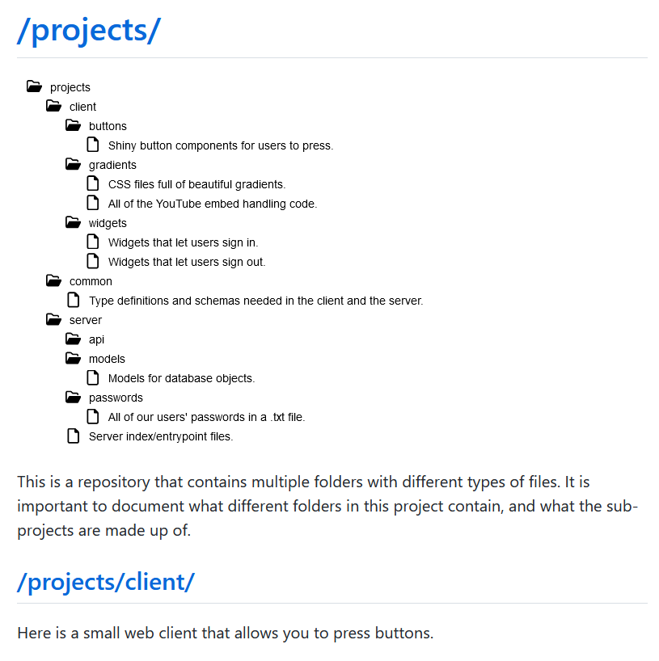

# Bundle.md

This is a command-line tool that will traverse a repository, find its README.md and CONTENTS.md files, and bundle them into a single Markdown document.



Each readme file will become a section in the final file with the path as its heading, and each line in each "contents" file will be added to a file tree diagram.

## Usage:

```
npx bundle-md root_directory_1 [root_directory_2 ...] [options...]
```

If there is more than one root directory, each will be processed separately and then their outputs will be concatenated.

### Options:

```
  --output output_directory, -o output_directory
  --exclude exclude_directories [exclude_directories ...], -e exclude_directories [exclude_directories ...]
  --exclude-glob exclude_glob [exclude_glob ...] = ["**/node_modules", "**/.*"]
  --no-tree treeless_directories [treeless_directories ...]
  --extra-tree extra_tree_directories [extra_tree_directories ...]
  --signoff, --no-signoff
```

All directory paths should be specified relative to the current working directory.

By default, the `exclude_glob` option is set to ignore "node_modules" folders and those whose names start with ".", like ".git". If you specify your own glob patterns for folders to ignore, those will be overwritten by your patterns.

`no-tree` can be used to avoid a graphical file tree being created for a folder, either because it's irrelevant or because it's too big and you want separate trees for its subfolders. For the latter case, exclude a folder with `--no-tree` and get tree diagrams for its subfolders by passing them to `--extra-tree`.

`signoff` defaults to true, meaning that the output file will end with a disclaimer that it's automatically generated. Specify `--no-signoff` to avoid this.

### Example:

```
npx bundle-md client server lib --exclude lib/unimportant --no-tree client --extra-tree client/next --no-signoff
```
